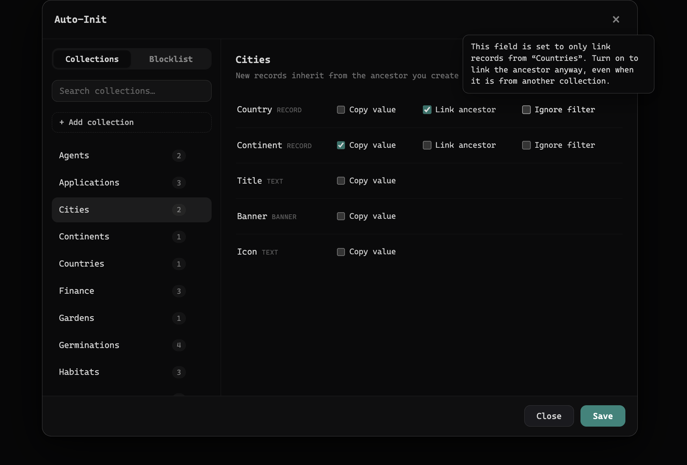
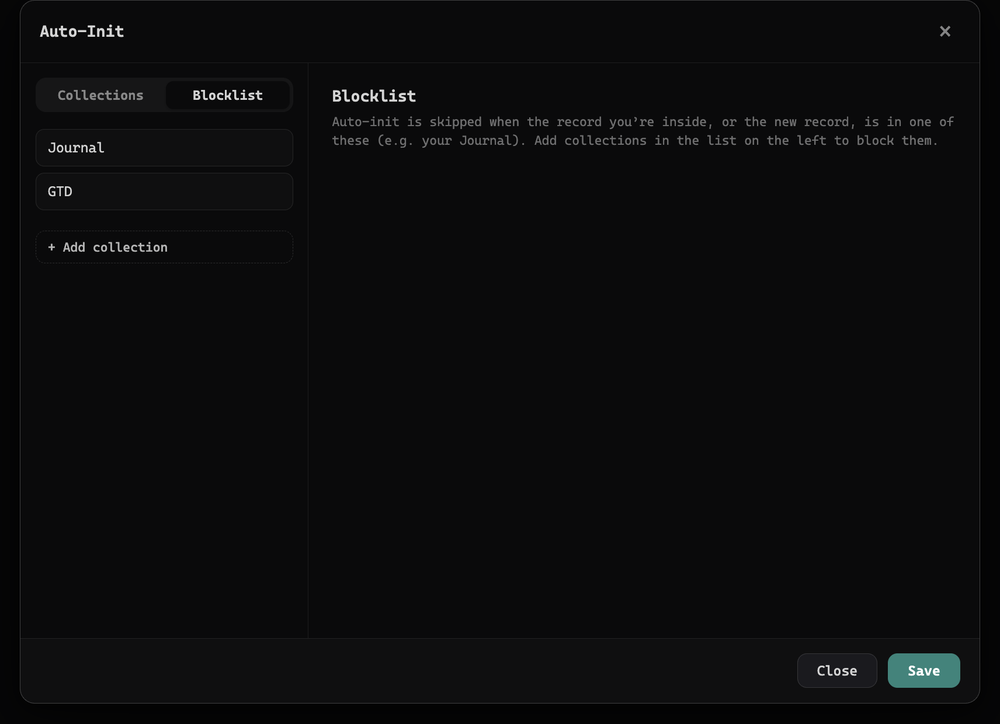

# Thymer Property Auto-Initiator

A workspace-wide [Thymer](https://thymer.com) app plugin that **auto-fills fields on newly created records** from the record you are currently viewing.

Create a new record while you are inside another record, and the plugin pre-fills fields on the new one from that "ancestor": either by **inheriting a value** (a tag, a date, a linked record) or by **linking the ancestor itself** (the classic "this belongs to that" pattern).

Everything is configured in a **visual settings panel**. No JSON, no per-collection files.

---

## Table of contents

- [What it does](#what-it-does)
- [How it works](#how-it-works)
- [Configuring it](#configuring-it)
- [Blocklist](#blocklist)
- [Installation](#installation)
- [Upgrading from the old version](#upgrading-from-the-old-version)
- [Troubleshooting](#troubleshooting)
- [Requirements](#requirements)
- [Contributing](#contributing)
- [Acknowledgements](#acknowledgements)
- [License](#license)

---

## What it does

Per field, per collection, you choose how a new record inherits from its ancestor:

| Toggle | Applies to | What it does |
|---|---|---|
| **Copy value** | all fields | Copies the ancestor's value from its matching field into the new record. |
| **Link ancestor** | record fields | Links the ancestor record itself into this field. |
| **Ignore filter** | record fields that have a collection filter | Links the ancestor even when it is from a collection the field's "Filter by collection" would normally not allow. |

Copy value and Link ancestor are independent. Turn on both and the plugin tries the value first, then falls back to linking the ancestor.

How **Copy value** finds the matching field on the ancestor:

- **Same collection** (for example sub-tasks in a Tasks collection): matched by field.
- **Different collections** (for example an Action created inside a Book): matched by field **label** (case-insensitive) and **type**.

Multi-value fields inherit all values, not just the first.

## How it works

1. The plugin remembers the record you are viewing in the focused editor. That is the **ancestor**. A 30-second staleness guard keeps a long-forgotten record from being used as the ancestor.
2. When you create a record, it looks up the rules you configured for that record's collection and applies them, only to fields that are still empty.
3. It never overwrites a field that already has a value, and it ignores records synced in from other devices.

Two things shape what actually happens: the per-field rules you set (below), and the collections you [exclude entirely](#blocklist). The plugin is event-driven and does nothing at rest, so it has no idle cost.

## Configuring it

Open the Command Palette (Cmd/Ctrl+P) and run **"Auto-Init: Settings"**. The panel has two tabs.

**Collections.** Search for a collection, or click **+ Add collection** to start configuring one. Select a collection to see its fields, then toggle **Copy value**, **Link ancestor**, and **Ignore filter** per field. A badge next to each collection shows how many active rules it has. Hover any toggle for a short explanation.

**Blocklist.** Collections listed here are skipped entirely (see below).

Click **Save** to apply. Nothing is written until you save.

## Blocklist

Some collections should never take part in auto-init. The **Blocklist** tab is where you list them.

A blocklisted collection is skipped whether it is the collection of the **new record** or of the **record you are creating it inside**. So nothing is auto-filled into it, and nothing is inherited from it.

Reach for this whenever a collection is a place you capture into rather than a structured record you want pre-filled: a daily-notes or Journal collection, a scratch area, an inbox, imported data, and so on. For example, adding a Journal collection keeps quick notes you jot from inside a page from being pre-filled.

## Installation

### Via Thymer's Plugins Manager (recommended)

1. Open **Plugins Manager → Install Plugin**.
2. Paste the repository URL: `https://github.com/parham-shafti/thymer-property-auto-initiator`
3. Confirm, then **hard-reload Thymer** (Cmd/Ctrl+Shift+R). A hard reload is required so the plugin can register its event listeners.

Updates can be pulled later with the refresh button on the plugin card.

### Manual

1. Go to **Plugin Settings → App Plugins → New Plugin**.
2. Paste the contents of [`plugin.json`](plugin.json) as the metadata and [`plugin.js`](plugin.js) as the code.
3. Save, then **hard-reload Thymer**.

See [`docs/INSTALL.md`](docs/INSTALL.md) for a step-by-step walkthrough.

## Upgrading from the old version

Earlier versions stored configuration in each collection's own `plugin.json`, edited by hand through a command-palette scaffold. This version keeps everything centrally and edits it through the Settings panel.

On first load after upgrading, the plugin **automatically imports** your existing per-collection rules into the central config and then removes the old blocks. Your setup carries over. There is nothing to do, and no risk to your data: the import is saved before anything is removed.

## Troubleshooting

### A field is not being filled

Open the Settings panel and confirm the collection has the rule you expect (Copy value or Link ancestor on that field). For cross-collection **Copy value** inheritance, the ancestor must have a field with the **same label and type**.

### A record got auto-initialized when it should not have

If it happened inside a collection you never want touched (a Journal, an inbox, a scratch area), add that collection on the **Blocklist** tab and Save.

### Nothing happens at all

Make sure you hard-reloaded Thymer after installing (Cmd/Ctrl+Shift+R), so the plugin's event listeners are registered.

## Requirements

- Thymer with app plugin support.
- A modern Chromium-based runtime (Thymer's desktop app, or Chrome / Edge / Arc on the web).

## Contributing

Issues and pull requests are welcome. Helpful reports include the collections and field rules involved, the ancestor and new record you created, and what you expected versus what happened.

## Acknowledgements

Thanks to **JD from Thymer** for the original "copy properties from parent" command-palette snippet that sparked this plugin. It grew from that seed into an event-driven, workspace-wide, visually configurable system.

## License

[MIT](LICENSE). Use it, modify it, share it, ship it.
